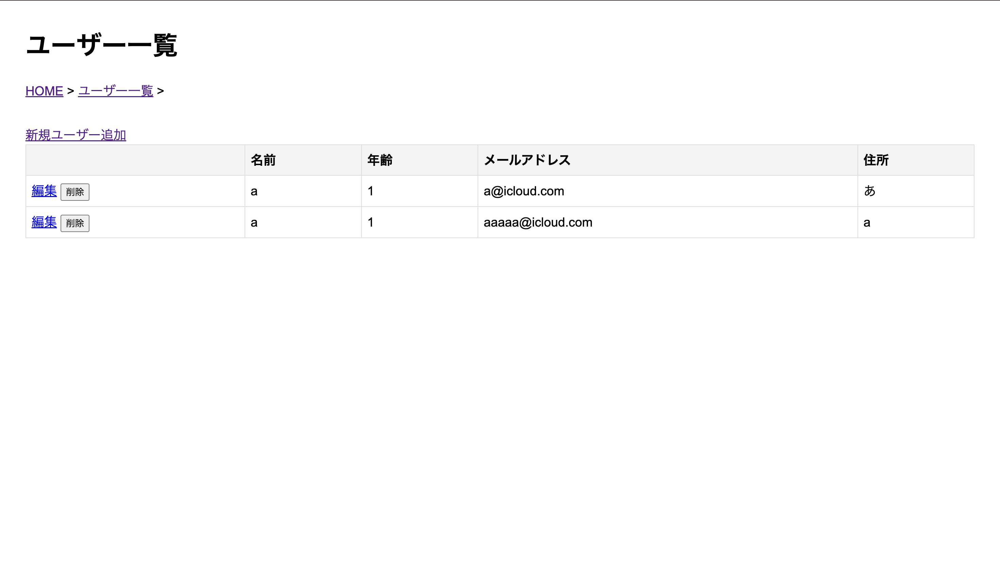

1. データ登録アプリケーションにて登録するデータ
   - User
     - id
     - name
     - age
     - email
     - address
   - Product
     - id
     - name
     - age
   - order
     - userId
     - ProductId
     - quantity
2. 自分が担当したデータや画面（文章での説明）
自分はユーザー(顧客)の画面を作成した。
ユーザー追加の部分でメールアドレスと住所の入力追加をした。
また、ユーザーの削除ボタンも作成した。
emailとaddressはCharField型で定義している。
削除ボタンが押されるとPOSTメソッドでユーザーを削除するAPIを呼び出している。
3. 自分が作成した画面のスクリーンショット

1. 感想
今回はチームが2人休んでしまい、大変だったが何とかリーダーが上手くやってくれたおかげで必要な部分は作成できた。
デバックの時にDBの初期化のし忘れなどがあり、システムが動かないことがあったが、AIなどに聞きながら動くようになった。これからはコードで解決できるようになりたい。